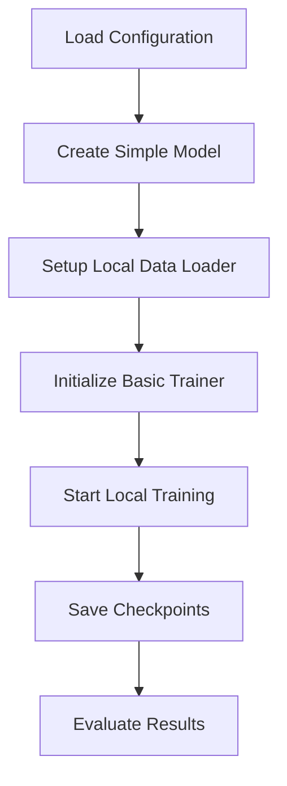
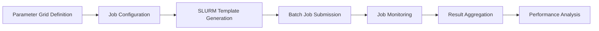
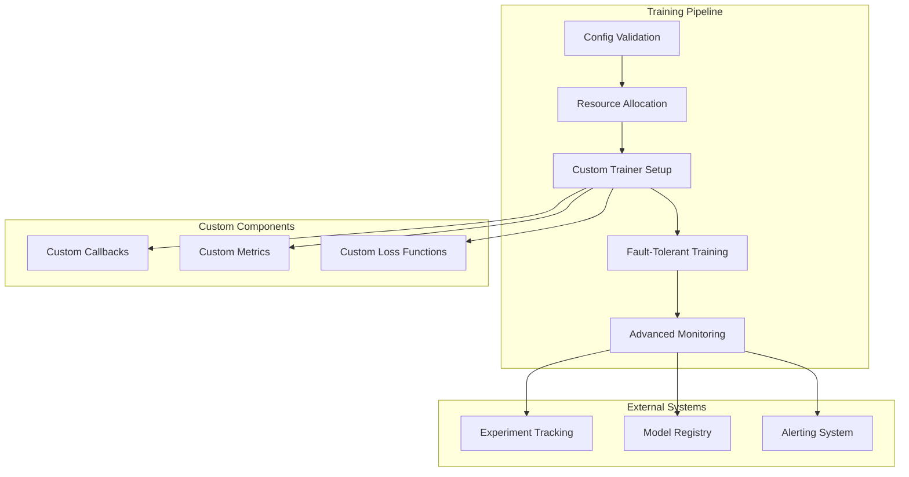
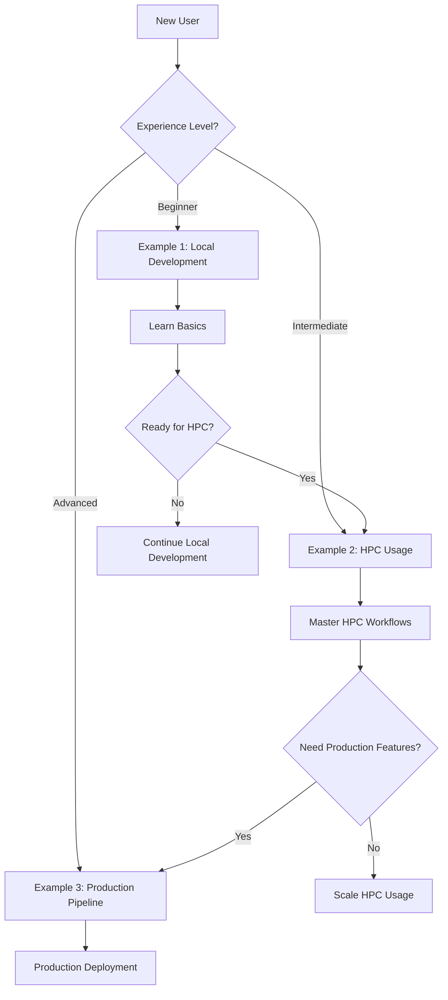

# Demo Directory Restructure Design

## Overview

This design outlines the restructuring of the `examples/` directory into a `demo/` directory with three distinct usage scenarios. Each scenario demonstrates different aspects of the model training framework, providing users with comprehensive real-world examples organized by complexity and use case.

## Current State Analysis

The existing `examples/` directory contains:

- `basic_training.py` - Simple training setup
- `grid_search.py` - Parameter grid search functionality
- `slurm_batch.py` - SLURM job submission and management
- `custom_trainer.py` - Custom trainer implementation
- `preemption_handling.py` - Fault-tolerant training
- `README.md` - Comprehensive documentation

These examples cover various aspects but lack clear organization by user journey and complexity levels.

## Proposed Demo Structure

### Directory Structure

```
demo/
├── README.md
├── example1_beginner_local/
│   ├── README.md
│   ├── basic_model_training.py
│   ├── config_examples/
│   │   ├── mnist_config.yaml
│   │   └── simple_config.yaml
│   └── data/
│       └── sample_dataset.py
├── example2_intermediate_hpc/
│   ├── README.md
│   ├── distributed_training.py
│   ├── hyperparameter_optimization.py
│   ├── configs/
│   │   ├── slurm_template.sh
│   │   ├── grid_search_config.yaml
│   │   └── distributed_config.yaml
│   └── utils/
│       ├── job_monitoring.py
│       └── result_analysis.py
└── example3_advanced_production/
    ├── README.md
    ├── production_pipeline.py
    ├── fault_tolerant_training.py
    ├── custom_components/
    │   ├── custom_trainer.py
    │   ├── custom_callbacks.py
    │   └── custom_metrics.py
    ├── configs/
    │   ├── production_config.yaml
    │   ├── preemption_config.yaml
    │   └── monitoring_config.yaml
    └── deployment/
        ├── job_scheduler.py
        └── experiment_tracker.py
```

## Demo Scenarios

### Example 1: Beginner Local Development (`example1_beginner_local`)

**Target Audience**: New users, researchers starting with the framework, local development

**Scenario Description**: A data scientist wants to quickly prototype and test model training locally before scaling to HPC environments.

**Key Features**:

- Simple local training setup
- Basic configuration management
- Single-node training
- Interactive development workflow
- Minimal dependencies

**Components**:

#### `basic_model_training.py`



**Configuration Examples**:

- `mnist_config.yaml` - Complete MNIST training setup
- `simple_config.yaml` - Minimal configuration template

**Learning Objectives**:

- Framework installation and setup
- Basic configuration file structure
- Local training execution
- Model checkpointing
- Results interpretation

### Example 2: Intermediate HPC Usage (`example2_intermediate_hpc`)

**Target Audience**: Researchers with HPC access, teams scaling experiments

**Scenario Description**: A research team needs to run hyperparameter optimization experiments across multiple compute nodes using SLURM job scheduling.

**Key Features**:

- SLURM integration and job submission
- Hyperparameter grid search
- Multi-node distributed training
- Job monitoring and management
- Resource optimization

**Components**:

#### Workflow Architecture



#### `distributed_training.py`

- Multi-GPU setup
- Data parallel training
- Gradient synchronization
- Resource allocation optimization

#### `hyperparameter_optimization.py`

- Grid search implementation
- Bayesian optimization integration
- Experiment tracking
- Results comparison

**Configuration Templates**:

- `slurm_template.sh` - SLURM job script template
- `grid_search_config.yaml` - Parameter grid definitions
- `distributed_config.yaml` - Multi-node training settings

**Learning Objectives**:

- SLURM job submission workflow
- Distributed training setup
- Parameter optimization strategies
- Resource management
- Experiment organization

### Example 3: Advanced Production Pipeline (`example3_advanced_production`)

**Target Audience**: ML engineers, production teams, advanced researchers

**Scenario Description**: A production ML team requires a robust, fault-tolerant training pipeline with custom components, preemption handling, and comprehensive monitoring for continuous model development.

**Key Features**:

- Production-grade fault tolerance
- Custom trainer implementations
- Advanced monitoring and logging
- Preemption handling
- Custom callbacks and metrics
- Integration with external systems

**Components**:

#### Production Architecture



#### `production_pipeline.py`

- End-to-end training pipeline
- Error handling and recovery
- Performance monitoring
- Automated experiment management

#### `fault_tolerant_training.py`

- Preemption signal handling
- Checkpoint recovery mechanisms
- State preservation
- Deterministic resume

#### Custom Components

- `custom_trainer.py` - Multi-task learning implementation
- `custom_callbacks.py` - Production callbacks (early stopping, learning rate scheduling)
- `custom_metrics.py` - Domain-specific metrics

**Configuration Examples**:

- `production_config.yaml` - Production-ready configuration
- `preemption_config.yaml` - Fault tolerance settings
- `monitoring_config.yaml` - Logging and tracking setup

**Learning Objectives**:

- Production pipeline design
- Fault tolerance implementation
- Custom component development
- Advanced monitoring setup
- System integration patterns

## Migration Strategy

### Phase 1: Directory Creation and Structure Setup

1. Create new `demo/` directory structure
2. Set up README files for each scenario
3. Create configuration templates

### Phase 2: Content Migration and Enhancement

1. Migrate existing examples to appropriate scenarios:
   - `basic_training.py` → `example1_beginner_local/basic_model_training.py`
   - `grid_search.py` + `slurm_batch.py` → `example2_intermediate_hpc/`
   - `custom_trainer.py` + `preemption_handling.py` → `example3_advanced_production/`

2. Enhance examples with scenario-specific features
3. Create additional supporting files

### Phase 3: Documentation and Testing

1. Update README files with comprehensive documentation
2. Create configuration examples
3. Test all scenarios independently
4. Validate cross-scenario compatibility

### Content Mapping Table

| Original File | Target Location | Enhancements |
|---------------|----------------|--------------|
| `basic_training.py` | `example1_beginner_local/basic_model_training.py` | Simplified interface, better documentation |
| `grid_search.py` | `example2_intermediate_hpc/hyperparameter_optimization.py` | SLURM integration, result analysis |
| `slurm_batch.py` | `example2_intermediate_hpc/distributed_training.py` | Multi-node support, monitoring |
| `custom_trainer.py` | `example3_advanced_production/custom_components/custom_trainer.py` | Production patterns, error handling |
| `preemption_handling.py` | `example3_advanced_production/fault_tolerant_training.py` | Extended fault tolerance, monitoring |
| `README.md` | `demo/README.md` + scenario READMEs | Scenario-specific guides |

## Implementation Considerations

### Configuration Management

- Each scenario maintains its own configuration templates
- Shared configuration patterns documented in main README
- Progressive complexity in configuration options

### Code Reusability

- Common utilities shared across scenarios
- Clear import paths and dependencies
- Minimal code duplication

### Documentation Strategy

- Scenario-specific README files with clear learning paths
- Code comments explaining scenario-specific concepts
- Cross-references between related scenarios

### Testing and Validation

- Each scenario includes validation scripts
- Integration tests for SLURM functionality
- Local execution fallbacks for development

## User Journey Flow



## Benefits of New Structure

### For Users

- **Clear Learning Path**: Progressive complexity from local to production
- **Scenario-Based Learning**: Real-world use cases with complete contexts
- **Reduced Cognitive Load**: Each scenario is self-contained and focused

### For Maintainers

- **Organized Codebase**: Better separation of concerns
- **Easier Updates**: Scenario-specific changes don't affect others
- **Improved Testing**: Independent validation for each use case

### For Framework Adoption

- **Lower Barrier to Entry**: Beginners can start with simple scenarios
- **Comprehensive Coverage**: All major use cases are demonstrated
- **Production Ready**: Advanced scenarios show real-world implementation patterns
