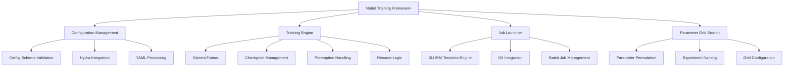
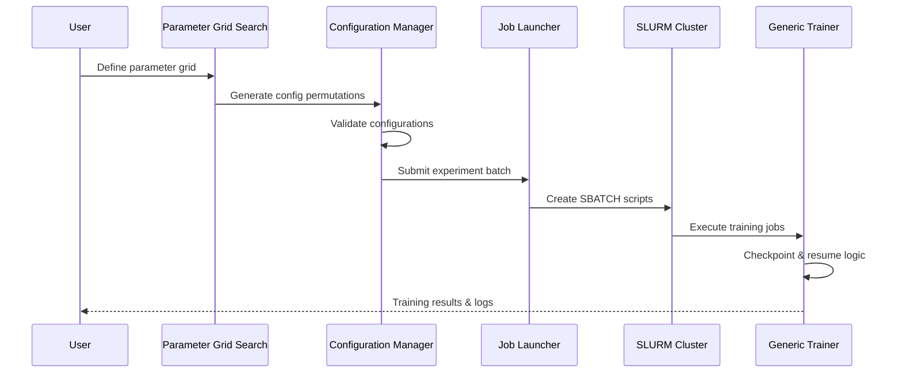
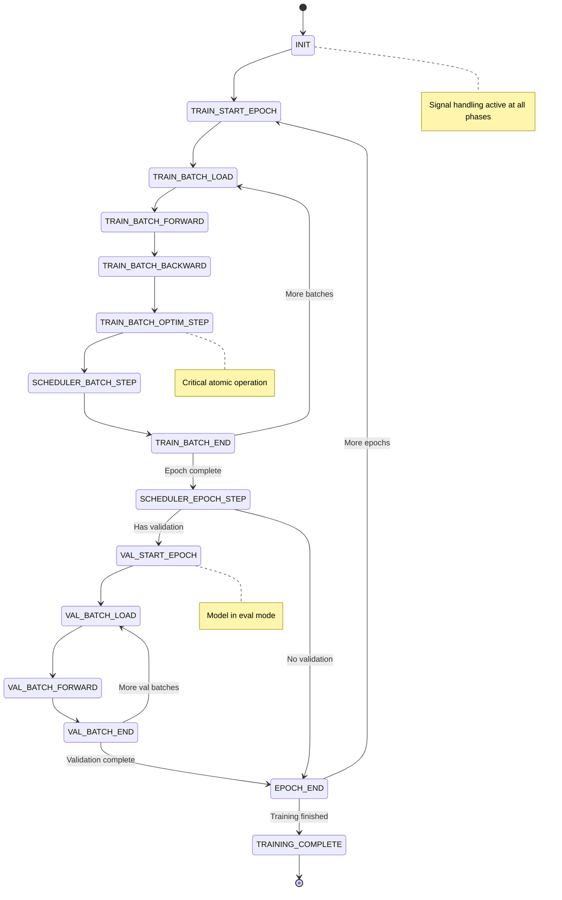
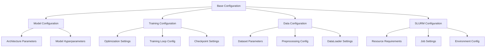

# Model Training Framework Design

## Overview

The Model Training Framework is a comprehensive Python package designed to standardize and streamline machine learning model training, job launching, and configuration management. The framework provides fault-tolerant training with SLURM integration, sophisticated parameter grid search capabilities, and robust experiment tracking.

### Key Features

- **Fault-Tolerant Training**: Preemption-safe training with instruction-level checkpointing
- **SLURM Integration**: Seamless job launching and management on HPC clusters
- **Parameter Grid Search**: Automatic enumeration and naming of experiment configurations
- **Configuration Management**: Structured configuration system with validation
- **Experiment Tracking**: Comprehensive logging and reproducibility features
- **Distributed Training**: Multi-node and multi-GPU support via Lightning Fabric

## Technology Stack & Dependencies

### Core Dependencies

- **PyTorch**: Deep learning framework for model implementation
- **Lightning Fabric**: Distributed training and hardware abstraction
- **Hydra**: Configuration management and composition
- **PyYAML**: YAML configuration file processing
- **NumPy**: Numerical computations and array operations

### Optional Dependencies

- **Weights & Biases (wandb)**: Experiment tracking and visualization
- **Colorlog**: Enhanced logging with color support
- **SLURM**: HPC job scheduling and resource management

## Architecture

### Component Hierarchy



### Data Flow Architecture



## Core Framework Components

### 1. Configuration Management System

#### Configuration Schema Definition

```python
@dataclass
class ExperimentConfig:
    """Master experiment configuration schema."""
    experiment_name: str
    model: ModelConfig
    training: TrainingConfig
    data: DataConfig
    optimizer: OptimizerConfig
    scheduler: Optional[SchedulerConfig] = None
    slurm: Optional[SLURMConfig] = None
    logging: LoggingConfig = field(default_factory=LoggingConfig)
```

#### Parameter Grid Search Engine

```python
class ParameterGridSearch:
    """Handles parameter permutation and experiment naming."""

    def __init__(self, base_config: Dict[str, Any]):
        self.base_config = base_config
        self.parameter_grids: List[ParameterGrid] = []

    def add_grid(self, name: str, parameters: Dict[str, List[Any]]) -> None:
        """Add a parameter grid for exploration."""

    def generate_experiments(self) -> List[ExperimentConfig]:
        """Generate all parameter permutations."""

    def get_experiment_name(self, config: ExperimentConfig) -> str:
        """Generate standardized experiment names."""
```

#### Configuration Validation System

```python
class ConfigValidator:
    """Validates experiment configurations against schema."""

    @staticmethod
    def validate_config(config: ExperimentConfig) -> ValidationResult:
        """Comprehensive configuration validation."""

    @staticmethod
    def check_resource_requirements(config: ExperimentConfig) -> ResourceCheck:
        """Validate SLURM resource requirements."""
```

### 2. Training Engine Architecture

#### Generic Trainer Core

The `GenericTrainer` implements fault-tolerant training with instruction-level checkpointing:

```python
class GenericTrainer:
    """Preemption-safe trainer with instruction-level checkpoint granularity."""

    def __init__(
        self,
        config: GenericTrainerConfig,
        fabric: Fabric,
        model: torch.nn.Module,
        optimizer: Optimizer,
        scheduler: Optional[_LRScheduler] = None,
        wandb_run: Optional[Any] = None,
    ):
        """Initialize trainer with comprehensive configuration."""

    def fit(
        self,
        train_loader: DataLoader,
        val_loader: Optional[DataLoader] = None,
        max_epochs: int = 1,
    ) -> None:
        """Resumable, preemption-safe training loop."""
```

#### Training Phase State Machine



#### Checkpoint Management

```python
@dataclass
class ResumeState:
    """Complete snapshot enabling deterministic resume after preemption."""
    phase: TrainerPhase
    epoch: int
    global_step: int
    version: str = "v2.0"
    train: Optional[TrainMicroState] = None
    val: Optional[ValMicroState] = None
    rng: Optional[RNGState] = None
    timestamp: float = 0.0
```

### 3. Job Launcher System

#### SLURM Integration Engine

```python
class SLURMLauncher:
    """Manages SLURM job submission and lifecycle."""

    def __init__(self, template_path: Path, project_root: Path):
        self.template_path = template_path
        self.project_root = project_root

    def submit_experiment_batch(
        self,
        experiments: List[ExperimentConfig]
    ) -> BatchSubmissionResult:
        """Submit multiple experiments as SLURM jobs."""

    def generate_sbatch_script(
        self,
        config: ExperimentConfig,
        context: Dict[str, Any]
    ) -> Path:
        """Generate SBATCH script from template."""
```

#### Git Integration & Branch Management

```python
class GitOperationLock:
    """Context manager for file-based locking to serialize git operations."""

    def __init__(self, lock_file_path: Path, timeout: float = 60.0):
        self.lock_file_path = lock_file_path
        self.timeout = timeout

    def __enter__(self) -> Self:
        """Acquire the lock with timeout."""

    def __exit__(self, exc_type, exc_val, exc_tb) -> None:
        """Release the lock and cleanup."""
```

#### Branch Naming Strategy

For reproducibility and conflict prevention, temporary branches follow the pattern:

```
slurm-job/<experiment_name>/<timestamp>/<commit_hash[:8]>
```

### 4. Parameter Grid Search System

#### Grid Definition Interface

```python
class ParameterGrid:
    """Defines a parameter search space."""

    def __init__(self, name: str, description: str = ""):
        self.name = name
        self.description = description
        self.parameters: Dict[str, List[Any]] = {}

    def add_parameter(self, key: str, values: List[Any]) -> None:
        """Add a parameter with possible values."""

    def add_nested_parameter(self, key_path: str, values: List[Any]) -> None:
        """Add nested parameter (e.g., 'model.lr', 'optimizer.weight_decay')."""

    def generate_permutations(self) -> Iterator[Dict[str, Any]]:
        """Generate all parameter combinations."""
```

#### Experiment Naming Convention

```python
class ExperimentNaming:
    """Standardized experiment naming system."""

    @staticmethod
    def generate_name(
        base_name: str,
        parameters: Dict[str, Any],
        naming_strategy: NamingStrategy = NamingStrategy.HASH_BASED
    ) -> str:
        """Generate experiment name based on parameters."""

    @staticmethod
    def parse_experiment_name(name: str) -> Dict[str, Any]:
        """Extract parameter information from experiment name."""
```

#### Grid Search Execution

```python
class GridSearchExecutor:
    """Orchestrates parameter grid search execution."""

    def __init__(
        self,
        launcher: SLURMLauncher,
        config_manager: ConfigurationManager
    ):
        self.launcher = launcher
        self.config_manager = config_manager

    def execute_grid_search(
        self,
        base_config: ExperimentConfig,
        parameter_grids: List[ParameterGrid],
        execution_mode: ExecutionMode = ExecutionMode.SLURM
    ) -> GridSearchResult:
        """Execute parameter grid search."""
```

## Configuration Architecture

### Hierarchical Configuration System



### Configuration Composition

```python
@dataclass
class ModelConfig:
    """Model architecture configuration."""
    type: str
    hidden_size: int = 512
    num_layers: int = 6
    dropout: float = 0.1
    activation: str = "relu"

@dataclass
class TrainingConfig:
    """Training process configuration."""
    max_epochs: int = 100
    batch_size: int = 32
    gradient_accumulation_steps: int = 1
    max_grad_norm: Optional[float] = 1.0
    use_amp: bool = True

@dataclass
class OptimizerConfig:
    """Optimizer configuration."""
    type: str = "adamw"
    lr: float = 1e-4
    weight_decay: float = 0.01
    betas: Tuple[float, float] = (0.9, 0.999)

@dataclass
class DataConfig:
    """Dataset configuration."""
    dataset_name: str
    train_split: str = "train"
    val_split: str = "validation"
    num_workers: int = 4
    pin_memory: bool = True
```

## API Integration Layer

### High-Level Framework Interface

```python
class ModelTrainingFramework:
    """High-level interface for the training framework."""

    def __init__(self, project_root: Path):
        self.project_root = project_root
        self.config_manager = ConfigurationManager(project_root)
        self.launcher = SLURMLauncher(
            template_path=project_root / "slurm" / "slurm_template.sbatch",
            project_root=project_root
        )
        self.grid_search = GridSearchExecutor(self.launcher, self.config_manager)

    def create_experiment(self, config_dict: Dict[str, Any]) -> ExperimentConfig:
        """Create and validate experiment configuration."""

    def run_single_experiment(
        self,
        config: ExperimentConfig,
        mode: ExecutionMode = ExecutionMode.SLURM
    ) -> ExperimentResult:
        """Execute a single experiment."""

    def run_grid_search(
        self,
        base_config: ExperimentConfig,
        parameter_grids: List[ParameterGrid]
    ) -> GridSearchResult:
        """Execute parameter grid search."""
```

### Usage Examples

#### Single Experiment Execution

```python
# Initialize framework
framework = ModelTrainingFramework(Path("/path/to/project"))

# Create experiment configuration
config = framework.create_experiment({
    "experiment_name": "resnet_baseline",
    "model": {
        "type": "resnet50",
        "num_classes": 1000
    },
    "training": {
        "max_epochs": 100,
        "batch_size": 64
    },
    "optimizer": {
        "type": "adamw",
        "lr": 1e-3
    }
})

# Execute experiment
result = framework.run_single_experiment(config)
```

#### Parameter Grid Search

```python
# Define parameter grid
grid = ParameterGrid("learning_rate_search")
grid.add_parameter("optimizer.lr", [1e-4, 5e-4, 1e-3, 5e-3])
grid.add_parameter("optimizer.weight_decay", [0.0, 0.01, 0.1])
grid.add_parameter("training.batch_size", [32, 64, 128])

# Execute grid search
results = framework.run_grid_search(base_config, [grid])
```

## Experiment Tracking Strategy

### Logging Architecture

```python
@dataclass
class LoggingConfig:
    """Comprehensive logging configuration."""
    use_wandb: bool = True
    wandb_project: Optional[str] = None
    wandb_entity: Optional[str] = None
    log_scalars_every_n_steps: Optional[int] = 50
    log_images_every_n_steps: Optional[int] = 500
    log_gradients: bool = False
    log_model_parameters: bool = False
```

### Experiment Organization

```
experiments/
├── <experiment_name>/
│   ├── config.yaml              # Experiment configuration
│   ├── <job_id>.sbatch         # Generated SLURM script
│   ├── <job_id>.out            # SLURM stdout log
│   ├── <job_id>.err            # SLURM stderr log
│   ├── checkpoints/            # Model checkpoints
│   │   ├── latest.ckpt -> epoch_005_step_001234.ckpt
│   │   ├── epoch_001_step_000456.ckpt
│   │   └── epoch_005_step_001234.ckpt
│   └── wandb/                  # W&B local files
└── grid_search_<timestamp>/
    ├── search_config.yaml      # Grid search configuration
    ├── exp_001/               # Individual experiment
    ├── exp_002/
    └── results_summary.json   # Aggregated results
```

## Python Package Structure

### Package Organization

```
model_training_framework/
├── __init__.py                 # Main package exports
├── config/                     # Configuration Management Component
│   ├── __init__.py
│   ├── schemas.py              # Configuration dataclasses and validation
│   ├── grid_search.py          # Parameter grid search engine
│   ├── manager.py              # Configuration management and composition
│   ├── naming.py               # Experiment naming strategies
│   └── validators.py           # Configuration validation logic
├── trainer/                    # Training Engine Component
│   ├── __init__.py
│   ├── core.py                 # GenericTrainer implementation
│   ├── checkpoints.py          # Checkpoint management
│   ├── states.py               # Training state management
│   ├── callbacks.py            # Training callbacks and hooks
│   └── utils.py                # Training utilities
├── slurm/                      # SLURM Integration Component
│   ├── __init__.py
│   ├── launcher.py             # Job launcher and batch submission
│   ├── templates.py            # SBATCH template management
│   ├── git_ops.py              # Git integration and branch management
│   ├── monitor.py              # Job monitoring and status tracking
│   └── utils.py                # SLURM utilities
├── framework.py                # High-level framework interface
├── exceptions.py               # Custom exception classes
├── constants.py                # Framework-wide constants
└── utils.py                    # Shared utilities
```

### Component Integration Architecture

```mermaid
graph TB
    A[Framework Interface] --> B[Config Component]
    A --> C[Trainer Component]
    A --> D[SLURM Component]

    B --> B1[Configuration Manager]
    B --> B2[Grid Search Engine]
    B --> B3[Schema Validator]

    C --> C1[Generic Trainer]
    C --> C2[Checkpoint Manager]
    C --> C3[State Manager]

    D --> D1[Job Launcher]
    D --> D2[Template Engine]
    D --> D3[Git Operations]

    B1 <--> C1 : Config Exchange
    B2 <--> D1 : Batch Jobs
    C2 <--> D3 : Version Control
```

## Component Implementation

### 1. Configuration Component (`config/`)

#### Configuration Schemas (`config/schemas.py`)

```python
from dataclasses import dataclass, field
from typing import Optional, Dict, Any, List, Tuple
from pathlib import Path

@dataclass
class ModelConfig:
    """Model architecture configuration."""
    type: str
    hidden_size: int = 512
    num_layers: int = 6
    dropout: float = 0.1
    activation: str = "relu"

@dataclass
class OptimizerConfig:
    """Optimizer configuration."""
    type: str = "adamw"
    lr: float = 1e-4
    weight_decay: float = 0.01
    betas: Tuple[float, float] = (0.9, 0.999)

@dataclass
class TrainerConfig:
    """Training configuration."""
    max_epochs: int = 100
    batch_size: int = 32
    gradient_accumulation_steps: int = 1
    use_amp: bool = True

@dataclass
class ExperimentConfig:
    """Complete experiment configuration."""
    experiment_name: str
    model: ModelConfig
    optimizer: OptimizerConfig
    trainer: TrainerConfig
    slurm: Optional[Dict[str, Any]] = None
```

#### Parameter Grid Search (`config/grid_search.py`)

```python
from itertools import product
from typing import Iterator, Dict, Any, List
from .schemas import ExperimentConfig
from .naming import ExperimentNaming

class ParameterGrid:
    """Parameter grid definition and permutation generator."""

    def __init__(self, name: str):
        self.name = name
        self.parameters: Dict[str, List[Any]] = {}

    def add_parameter(self, key: str, values: List[Any]) -> 'ParameterGrid':
        """Add parameter with possible values (fluent interface)."""
        self.parameters[key] = values
        return self

    def generate_configs(self, base_config: ExperimentConfig) -> List[ExperimentConfig]:
        """Generate all parameter combinations as configs."""
        if not self.parameters:
            return [base_config]

        keys = list(self.parameters.keys())
        value_combinations = product(*[self.parameters[key] for key in keys])

        configs = []
        for values in value_combinations:
            config = self._apply_parameters(base_config, dict(zip(keys, values)))
            configs.append(config)

        return configs
```

### 2. Trainer Component (`trainer/`)

#### Core Trainer (`trainer/core.py`)

```python
from lightning.fabric import Fabric
from torch.optim import Optimizer
from torch.optim.lr_scheduler import _LRScheduler
from ..config.schemas import TrainerConfig, ExperimentConfig
from .states import TrainingState
from .checkpoints import CheckpointManager

class GenericTrainer:
    """Enhanced trainer with configuration integration."""

    def __init__(
        self,
        config: ExperimentConfig,
        fabric: Fabric,
        model: torch.nn.Module,
        optimizer: Optimizer,
        scheduler: Optional[_LRScheduler] = None,
    ):
        self.config = config
        self.fabric = fabric
        self.model = model
        self.optimizer = optimizer
        self.scheduler = scheduler

        # Initialize components
        self.state = TrainingState(config.trainer)
        self.checkpoint_manager = CheckpointManager(
            config.experiment_name,
            fabric
        )

    @classmethod
    def from_config(cls, config: ExperimentConfig, fabric: Fabric) -> 'GenericTrainer':
        """Create trainer from experiment configuration."""
        # Build model, optimizer from config
        model = cls._build_model(config.model)
        optimizer = cls._build_optimizer(model, config.optimizer)

        return cls(config, fabric, model, optimizer)
```

### 3. SLURM Component (`slurm/`)

#### Job Launcher (`slurm/launcher.py`)

```python
from pathlib import Path
from typing import List, Dict, Any
from ..config.schemas import ExperimentConfig
from .templates import SBATCHTemplate
from .git_ops import GitManager

class SLURMLauncher:
    """SLURM job launcher with configuration integration."""

    def __init__(self, project_root: Path, template_path: Path):
        self.project_root = project_root
        self.template = SBATCHTemplate(template_path)
        self.git_manager = GitManager(project_root)

    def submit_experiments(self, configs: List[ExperimentConfig]) -> List[str]:
        """Submit multiple experiments to SLURM."""
        job_ids = []

        for config in configs:
            job_id = self.submit_single_experiment(config)
            job_ids.append(job_id)

        return job_ids

    def submit_single_experiment(self, config: ExperimentConfig) -> str:
        """Submit single experiment to SLURM."""
        # Generate SBATCH script
        script_path = self._generate_sbatch_script(config)

        # Submit job
        result = subprocess.run(
            ["sbatch", str(script_path)],
            capture_output=True,
            text=True,
            check=True
        )

        # Extract job ID
        job_id = self._extract_job_id(result.stdout)
        return job_id
```

## Framework Interface (`framework.py`)

```python
from pathlib import Path
from typing import List, Dict, Any, Optional
from .config import ConfigurationManager, ParameterGrid
from .trainer import GenericTrainer
from .slurm import SLURMLauncher
from .config.schemas import ExperimentConfig

class ModelTrainingFramework:
    """High-level interface for the complete training framework."""

    def __init__(self, project_root: Path):
        self.project_root = project_root

        # Initialize components
        self.config_manager = ConfigurationManager(project_root)
        self.launcher = SLURMLauncher(
            project_root,
            project_root / "slurm" / "template.sbatch"
        )

    def create_experiment(self, config_dict: Dict[str, Any]) -> ExperimentConfig:
        """Create and validate experiment configuration."""
        return self.config_manager.create_config(config_dict)

    def run_experiment(self, config: ExperimentConfig, local: bool = False) -> str:
        """Run single experiment (local or SLURM)."""
        if local:
            return self._run_local_experiment(config)
        else:
            return self.launcher.submit_single_experiment(config)

    def run_grid_search(
        self,
        base_config: ExperimentConfig,
        parameter_grids: List[ParameterGrid]
    ) -> List[str]:
        """Execute parameter grid search."""
        # Generate all experiment configurations
        all_configs = []
        for grid in parameter_grids:
            configs = grid.generate_configs(base_config)
            all_configs.extend(configs)

        # Submit batch to SLURM
        job_ids = self.launcher.submit_experiments(all_configs)
        return job_ids
```

## Package Entry Points (`__init__.py`)

```python
"""Model Training Framework - A comprehensive ML training and experiment management system."""

__version__ = "1.0.0"

# Main framework interface
from .framework import ModelTrainingFramework

# Configuration components
from .config import (
    ExperimentConfig,
    ModelConfig,
    OptimizerConfig,
    TrainerConfig,
    ParameterGrid,
    ConfigurationManager
)

# Trainer components
from .trainer import GenericTrainer

# SLURM components
from .slurm import SLURMLauncher

__all__ = [
    "ModelTrainingFramework",
    "ExperimentConfig",
    "ModelConfig",
    "OptimizerConfig",
    "TrainerConfig",
    "ParameterGrid",
    "GenericTrainer",
    "SLURMLauncher",
]
```

## Usage Examples

### Simple Experiment

```python
from model_training_framework import ModelTrainingFramework, ParameterGrid

# Initialize framework
framework = ModelTrainingFramework(Path("/path/to/project"))

# Create experiment
config = framework.create_experiment({
    "experiment_name": "resnet_baseline",
    "model": {"type": "resnet50", "hidden_size": 512},
    "optimizer": {"lr": 1e-3, "weight_decay": 0.01},
    "trainer": {"max_epochs": 100, "batch_size": 64}
})

# Submit to SLURM
job_id = framework.run_experiment(config)
print(f"Submitted job: {job_id}")
```

### Parameter Grid Search

```python
# Define parameter grids
grid = ParameterGrid("lr_search")
grid.add_parameter("optimizer.lr", [1e-4, 5e-4, 1e-3])
grid.add_parameter("optimizer.weight_decay", [0.0, 0.01, 0.1])

# Execute grid search
job_ids = framework.run_grid_search(base_config, [grid])
print(f"Submitted {len(job_ids)} experiments")
```
