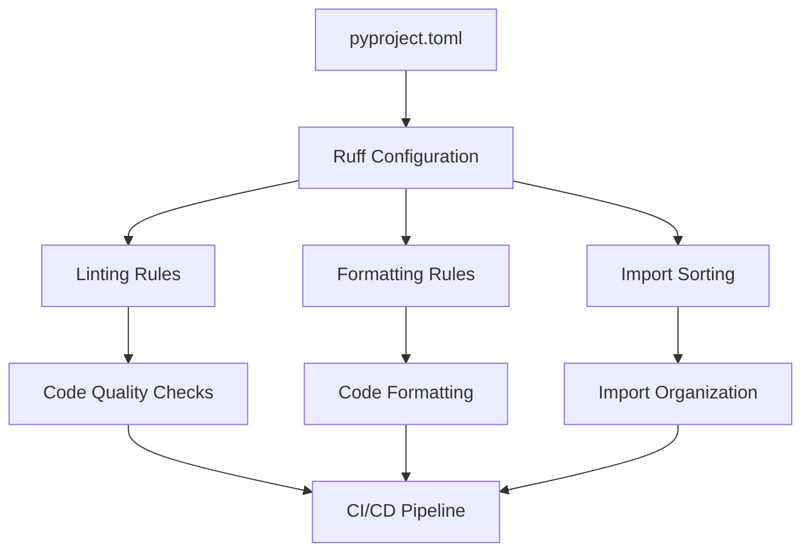

# Ruff Linter and Formatter Setup with GitHub CI/CD Workflow

## Overview

This design document outlines the implementation of Ruff as the primary linter and formatter for the Model Training Framework project, replacing the current Black, isort, and flake8 tools with a single, high-performance Rust-based solution. The implementation includes GitHub Actions workflow for automated code quality checks and continuous integration.

## Technology Stack & Dependencies

### Current Development Tools (To Be Replaced)

- **Black**: Code formatter
- **isort**: Import sorter
- **flake8**: Linter

### New Tool Stack

- **Ruff**: Unified linter and formatter (replaces Black, isort, flake8)
- **GitHub Actions**: CI/CD automation
- **Python 3.8+**: Runtime environment

## Architecture

### Ruff Configuration Strategy

### GitHub Workflow Architecture

## Ruff Configuration

### Configuration File Structure

The Ruff configuration will be defined in `pyproject.toml` with the following sections:

#### Linting Configuration

- **Rule Selection**: Enable comprehensive rule sets including:
  - `E` and `W` (pycodestyle errors and warnings)
  - `F` (Pyflakes)
  - `I` (isort)
  - `N` (pep8-naming)
  - `UP` (pyupgrade)
  - `B` (flake8-bugbear)
  - `C4` (flake8-comprehensions)
  - `PIE` (flake8-pie)
  - `SIM` (flake8-simplify)

#### Formatting Configuration

- **Line Length**: 88 characters (Black-compatible)
- **Quote Style**: Double quotes
- **Indentation**: 4 spaces
- **Import Sorting**: Automatic with section separation

#### Exclusions and Ignores

- **Excluded Paths**:
  - `__pycache__`
  - `.git`
  - `build/`
  - `dist/`
  - `.venv/`
- **Ignored Rules**: Project-specific rule exceptions

### Target Directories

- `model_training_framework/`
- `examples/`
- `tests/`
- Root-level Python files

## GitHub Actions Workflow

### Workflow Structure

#### Trigger Configuration

- **Push Events**: All branches
- **Pull Request Events**: Target main/master branch
- **Manual Dispatch**: Allow manual workflow runs

#### Job Matrix Strategy

- **Python Versions**: 3.8, 3.9, 3.10, 3.11
- **Operating Systems**: Ubuntu Latest, Windows Latest, macOS Latest

#### Workflow Steps

1. **Environment Setup**
   - Checkout repository
   - Setup Python environment with specified version
   - Cache pip dependencies

2. **Dependency Installation**
   - Install package dependencies
   - Install development dependencies including Ruff

3. **Code Quality Checks**
   - Run Ruff linting checks
   - Run Ruff formatting checks (dry-run)
   - Generate detailed error reports

4. **Testing Phase**
   - Execute pytest test suite
   - Generate coverage reports
   - Upload coverage to codecov (optional)

5. **Package Build Verification**
   - Build package using setup.py
   - Verify package integrity

6. **Artifact Management**
   - Upload build artifacts
   - Store test reports

### Performance Optimization

#### Caching Strategy

- **Pip Cache**: Cache installed packages
- **Ruff Cache**: Cache linting results for unchanged files
- **Test Cache**: Cache pytest results

#### Parallel Execution

- Run linting and testing in parallel where possible
- Matrix builds for multiple Python versions

## Integration Points

### Development Environment Integration

#### Pre-commit Hooks

- Configure pre-commit to run Ruff checks before commits
- Automatic formatting on staged files
- Prevent commits that fail linting

#### IDE Integration

- VS Code Ruff extension configuration
- PyCharm Ruff plugin setup
- Editor-specific formatting on save

### Package Dependencies Update

#### setup.py Modifications

- Remove Black, isort, flake8 from dev_requires
- Add Ruff to development dependencies
- Update version constraints

#### requirements.txt Updates

- Replace legacy tools with Ruff
- Maintain compatibility with existing workflows

## Migration Strategy

### Phase 1: Configuration Setup

1. Add Ruff configuration to pyproject.toml
2. Install Ruff in development environment
3. Test configuration against existing codebase

### Phase 2: Codebase Formatting

1. Run Ruff formatter across entire codebase
2. Commit formatting changes
3. Verify no functionality regressions

### Phase 3: CI/CD Integration

1. Create GitHub Actions workflow
2. Test workflow with sample commits
3. Enable branch protection rules

### Phase 4: Legacy Tool Removal

1. Remove Black, isort, flake8 from dependencies
2. Update documentation
3. Clean up old configuration files

## Error Handling and Reporting

### Workflow Failure Scenarios

#### Linting Failures

- Generate detailed error reports
- Annotate PR with specific line issues
- Provide fix suggestions where possible

#### Formatting Issues

- Show diff of required changes
- Option to auto-fix via bot comments
- Clear instructions for manual fixes

#### Test Failures

- Detailed test output in workflow logs
- Coverage reports with change analysis
- Integration with PR status checks

### Notification Strategy

- Slack/email notifications for workflow failures
- PR status checks with clear pass/fail indicators
- Automated comments with fix suggestions

## Testing Strategy

### Workflow Testing

- Test workflow on feature branches
- Verify matrix builds across Python versions
- Test failure scenarios and error reporting

### Ruff Configuration Testing

- Validate rules against existing codebase
- Test auto-fix capabilities
- Verify import sorting behavior

### Integration Testing

- Test pre-commit hook functionality
- Verify IDE integration works correctly
- Test package build process with new configuration

## Performance Considerations

### Ruff Performance Benefits

- **Speed**: 10-100x faster than Black + isort + flake8
- **Memory Usage**: Lower memory footprint
- **Single Tool**: Reduced overhead from multiple tools

### CI/CD Optimization

- **Incremental Checks**: Only check changed files when possible
- **Caching**: Aggressive caching of dependencies and results
- **Parallel Execution**: Maximize concurrency in workflow steps

### Resource Management

- **Timeout Configuration**: Reasonable timeouts for each step
- **Resource Limits**: Appropriate resource allocation
- **Failure Fast**: Quick failure detection and reporting
