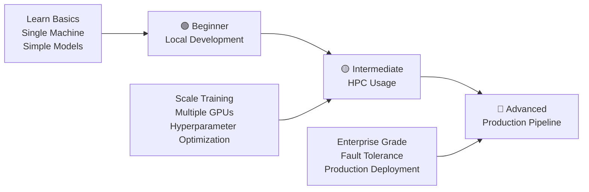

# Model Training Framework - Demo Scenarios

Welcome to the comprehensive demo suite for the Model Training Framework! This collection of scenarios will guide you through progressively advanced use cases, from local development to enterprise production deployments.

## 🎯 Overview

The demo scenarios are organized into three progressive stages that mirror real-world ML development workflows:



## 📁 Scenario Structure

### 🟢 [Example 1: Beginner Local Development](example1_beginner_local/)

#### Perfect for newcomers learning the framework basics

```text
example1_beginner_local/
├── basic_model_training.py      # Simple training script
├── config_examples/             # Basic configurations
│   ├── simple_config.yaml       # Minimal setup
│   └── mnist_config.yaml        # Complete example
└── data/
    └── sample_dataset.py        # Synthetic datasets
```

**What you'll learn:**

- Framework installation and setup
- Basic configuration management
- Local training execution
- Model checkpointing
- Results interpretation

**Time investment:** 30-60 minutes

### 🟡 [Example 2: Intermediate HPC Usage](example2_intermediate_hpc/)

#### For scaling to HPC clusters and systematic experimentation

```text
example2_intermediate_hpc/
├── hyperparameter_optimization.py # Grid search for HPC
├── distributed_training.py        # Multi-node training
├── configs/                       # SLURM configurations
│   ├── slurm_template.sh          # Job submission template
│   ├── grid_search_config.yaml    # Parameter grid setup
│   └── distributed_config.yaml    # Multi-node configuration
└── utils/                         # Monitoring tools
    ├── job_monitoring.py          # SLURM job tracking
    └── result_analysis.py         # Experiment analysis
```

**What you'll learn:**

- SLURM job submission and management
- Multi-GPU and multi-node training
- Systematic hyperparameter optimization
- Resource allocation strategies
- Experiment tracking and analysis

**Time investment:** 2-4 hours

### 🔴 [Example 3: Advanced Production Pipeline](example3_advanced_production/)

#### For enterprise-grade production deployments

```text
example3_advanced_production/
├── fault_tolerant_training.py     # Enterprise fault tolerance
├── custom_components/              # Advanced components
│   ├── custom_trainer.py          # Multi-task learning
│   ├── custom_callbacks.py        # Production callbacks
│   └── custom_metrics.py          # Advanced metrics
├── configs/                       # Production configurations
│   ├── production_config.yaml     # Enterprise settings
│   ├── preemption_config.yaml     # Fault tolerance
│   └── monitoring_config.yaml     # Monitoring setup
└── deployment/                    # Production deployment
    ├── job_scheduler.py           # Enterprise scheduler
    └── experiment_tracker.py      # Advanced tracking
```text

**What you'll learn:**

- Production-grade fault tolerance
- Advanced multi-task learning
- Comprehensive monitoring and alerting
- Enterprise deployment strategies
- Security and compliance

**Time investment:** 4-8 hours

## 🛣️ Recommended Learning Path

### Path 1: Quick Start (1-2 hours)

```text

Start Here → Example 1 → Basic training → Done

```

Perfect for: Getting familiar with the framework basics

### Path 2: Research Workflow (4-6 hours)

```text
Example 1 → Example 2 → Hyperparameter optimization → Analysis
```

Perfect for: Academic research and systematic experimentation

### Path 3: Complete Journey (8-12 hours)

```text
Example 1 → Example 2 → Example 3 → Production deployment
```

Perfect for: Enterprise ML engineering and production systems

### Path 4: Production Focus (6-8 hours)

```text
Example 1 (quick) → Example 3 → Enterprise deployment
```

Perfect for: ML engineers building production systems

## 🎓 User Personas and Recommendations

### 👨‍🎓 **ML Student / Researcher**

**Start with:** Example 1 → Example 2
**Focus on:** Understanding framework concepts, experimentation workflows
**Time needed:** 3-4 hours
**Key benefits:** Learn systematic ML development practices

### 👩‍💻 **Data Scientist**

**Start with:** Example 1 → Example 2
**Focus on:** Local development, hyperparameter optimization
**Time needed:** 4-5 hours
**Key benefits:** Scale experiments efficiently, systematic optimization

### 🏗️ **ML Engineer**

**Start with:** Example 1 (quick) → Example 3
**Focus on:** Production deployment, fault tolerance, monitoring
**Time needed:** 6-8 hours
**Key benefits:** Enterprise-grade ML systems, production reliability

### 👨‍🔬 **Research Team Lead**

**Complete path:** All examples
**Focus on:** Team workflows, scalability, resource management
**Time needed:** 8-12 hours
**Key benefits:** Comprehensive team training, systematic research workflows

### 🏢 **Enterprise Architect**

**Start with:** Example 3 → Production deployment
**Focus on:** Security, compliance, scalability, monitoring
**Time needed:** 4-6 hours
**Key benefits:** Enterprise integration, compliance, security

## 🚀 Getting Started

### Quick Setup (5 minutes)

1. **Clone and install the framework:**

   ```bash
   git clone <repository-url>
   cd model_training_framework
   pip install -e .
   ```

2. **Install demo dependencies:**

   ```bash
   pip install torch torchvision pyyaml
   # For advanced features:
   pip install wandb tensorboard psutil
   ```

3. **Choose your starting point:**

   ```bash
   cd demo/

   # For beginners
   cd example1_beginner_local
   python basic_model_training.py

   # For HPC users
   cd example2_intermediate_hpc
   python hyperparameter_optimization.py

   # For production teams
   cd example3_advanced_production
   python fault_tolerant_training.py
   ```

### Prerequisites by Scenario

| Scenario | Local Dev | HPC Access | Production Env | GPU Required |
|----------|-----------|------------|----------------|--------------|
| Example 1 | ✅ | ❌ | ❌ | Optional |
| Example 2 | ✅ | ✅ | ❌ | Recommended |
| Example 3 | ✅ | ✅ | ✅ | Recommended |

## 🗺️ Detailed User Journey

### Stage 1: Foundation (Example 1)

```text
🎯 Goal: Learn framework basics
📚 Concepts: Configuration, training loops, checkpointing
⏱️ Time: 30-60 minutes
🛠️ Skills gained: Local development, basic troubleshooting
```

**Learning Checkpoints:**

- [ ] Successfully run basic training
- [ ] Modify configuration files
- [ ] Understand training outputs
- [ ] Load and inspect checkpoints

### Stage 2: Scaling (Example 2)

```text
🎯 Goal: Scale to HPC environments
📚 Concepts: SLURM, distributed training, hyperparameter optimization
⏱️ Time: 2-4 hours
🛠️ Skills gained: HPC workflows, systematic experimentation
```

**Learning Checkpoints:**

- [ ] Submit SLURM jobs successfully
- [ ] Run multi-GPU training
- [ ] Execute hyperparameter grids
- [ ] Analyze experiment results
- [ ] Monitor resource utilization

### Stage 3: Production (Example 3)

```text
🎯 Goal: Deploy production-grade systems
📚 Concepts: Fault tolerance, monitoring, enterprise deployment
⏱️ Time: 4-8 hours
🛠️ Skills gained: Production reliability, advanced monitoring
```

**Learning Checkpoints:**

- [ ] Implement fault-tolerant training
- [ ] Set up comprehensive monitoring
- [ ] Deploy multi-task learning
- [ ] Configure enterprise security
- [ ] Design production workflows

## 🔧 Customization Guide

### Adapting to Your Environment

#### Academic/Research Environment

```yaml
# Focus on experimentation and resource efficiency
training:
  epochs: 50-100          # Moderate training length
  save_strategy: "epoch"  # Regular checkpointing
logging:
  use_wandb: true        # Experiment tracking
  detailed_metrics: true # Research insights
```

#### Enterprise Environment

```yaml
# Focus on reliability and compliance
security:
  encrypt_checkpoints: true
  audit_logging: true
monitoring:
  comprehensive_alerts: true
  performance_tracking: true
compliance:
  gdpr_compliant: true
  audit_trail: true
```

#### HPC Environment

```yaml
# Focus on resource optimization
slurm:
  partition: "gpu"
  exclusive: true
  time_limit: "24:00:00"
performance:
  mixed_precision: true
  distributed_training: true
```

### Adding Your Own Scenarios

1. **Create scenario directory:**

   ```bash
   mkdir demo/example4_custom_scenario
   cd demo/example4_custom_scenario
   ```

2. **Follow the structure pattern:**

   ```text
   example4_custom_scenario/
   ├── README.md              # Scenario documentation
   ├── main_script.py         # Primary example
   ├── configs/               # Configuration files
   └── utils/                 # Supporting utilities
   ```

3. **Document your scenario:**
   - Target audience
   - Learning objectives
   - Prerequisites
   - Step-by-step instructions

## 📊 Progress Tracking

### Skill Assessment Checklist

#### Beginner Level ✅

- [ ] Framework installation and setup
- [ ] Basic configuration management
- [ ] Local training execution
- [ ] Understanding training metrics
- [ ] Checkpoint management

#### Intermediate Level ✅

- [ ] SLURM job submission
- [ ] Multi-GPU training setup
- [ ] Hyperparameter optimization
- [ ] Resource monitoring
- [ ] Experiment analysis

#### Advanced Level ✅

- [ ] Fault-tolerant system design
- [ ] Production monitoring setup
- [ ] Multi-task learning implementation
- [ ] Enterprise deployment strategies
- [ ] Security and compliance

### Completion Certificates

Track your progress through the scenarios:

- 🥉 **Bronze**: Completed Example 1
- 🥈 **Silver**: Completed Examples 1-2
- 🥇 **Gold**: Completed all Examples 1-3
- 🏆 **Expert**: Customized and deployed production system

## 🤝 Community and Support

### Getting Help

1. **Documentation**: Check scenario-specific READMEs
2. **GitHub Issues**: Report bugs and request features
3. **Discussions**: Ask questions and share experiences
4. **Community Slack**: Real-time help and collaboration

### Contributing

We welcome contributions to improve the demo scenarios:

1. **Bug fixes**: Fix issues in existing examples
2. **Enhancements**: Improve documentation and code
3. **New scenarios**: Add specialized use cases
4. **Feedback**: Share your experience and suggestions

### Feedback and Improvement

Help us improve the demo experience:

```bash
# Rate scenarios (1-5 stars)
Rate Example 1: ⭐⭐⭐⭐⭐
Rate Example 2: ⭐⭐⭐⭐⭐
Rate Example 3: ⭐⭐⭐⭐⭐

# Provide feedback
What worked well: ________________
What could be improved: ___________
Suggestions for new scenarios: ____
```

## 📚 Additional Resources

### Framework Documentation

- [Getting Started Guide](../docs/getting_started.md)
- [Configuration Reference](../docs/configuration.md)
- [API Documentation](../docs/api.md)
- [Best Practices](../docs/best_practices.md)

### External Learning Resources

- [PyTorch Tutorials](https://pytorch.org/tutorials/)
- [SLURM Documentation](https://slurm.schedmd.com/documentation.html)
- [MLOps Best Practices](https://ml-ops.org/)
- [Production ML Systems](https://developers.google.com/machine-learning/guides/rules-of-ml)

### Community Resources

- [GitHub Repository](https://github.com/model-training-framework)
- [Discussion Forum](https://github.com/model-training-framework/discussions)
- [Slack Community](https://join.slack.com/...)
- [Twitter Updates](https://twitter.com/...)

---

## 🎉 Ready to Start

Choose your path and begin your journey:

### 🟢 New to the framework

**Start here:** [`example1_beginner_local/`](example1_beginner_local/)

### 🟡 Ready for HPC scaling

**Continue to:** [`example2_intermediate_hpc/`](example2_intermediate_hpc/)

### 🔴 Building production systems

**Advance to:** [`example3_advanced_production/`](example3_advanced_production/)

**Welcome to the Model Training Framework community!** 🚀
